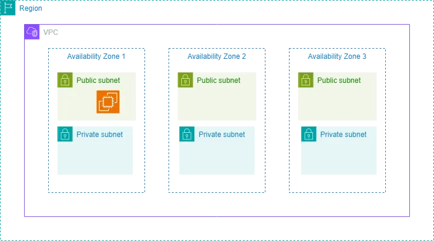

# deploying-servers-with-terraform

to build this infrastructure to deploy a single server inside AWS using terraform



##  Building the basic infrastructure without the server


## Show the current infrastructure

```
terraform show 

```

not set

## Update your Configuration to include EC2 instance

- Append the following code to main.tf

```
provider "aws" {
  region = "us-west-2"
}

# Define VPC
resource "aws_vpc" "main" {
  cidr_block = "10.0.0.0/16"
  tags = {
    Name = "main_vpc"
  }
}

# Define Subnets
resource "aws_subnet" "public_subnets" {
  for_each = {
    public_subnet_1 = "10.0.1.0/24"
    public_subnet_2 = "10.0.2.0/24"
  }
  vpc_id     = aws_vpc.main.id
  cidr_block = each.value
  map_public_ip_on_launch = true
  tags = {
    Name = each.key
  }
}

# Terraform Data Block - To Lookup Latest Ubuntu 20.04 AMI Image
data "aws_ami" "ubuntu" {
  most_recent = true

  filter {
    name   = "name"
    values = ["ubuntu/images/hvm-ssd/ubuntu-focal-20.04-amd64-server-*"]
  }

  filter {
    name   = "virtualization-type"
    values = ["hvm"]
  }

  owners = ["099720109477"]
}

# Terraform Resource Block - To Build EC2 instance in Public Subnet
resource "aws_instance" "web_server" {
  ami           = data.aws_ami.ubuntu.id
  instance_type = "t2.micro"
  subnet_id     = aws_subnet.public_subnets["public_subnet_1"].id
  tags = {
    Name = "Ubuntu EC2 Server"
  }
}

```

- Plan and Execute Changes
- Show New State
- Delete the AWS resources using Terraform to clean up our AWS environment

*Output*

```
vagrant@cloud-native-box:~/hands-on-terraform/deploying-servers-with-terraform$ terraform init
Initializing the backend...
Initializing provider plugins...
- Reusing previous version of hashicorp/aws from the dependency lock file
- Using previously-installed hashicorp/aws v5.65.0

Terraform has been successfully initialized!

You may now begin working with Terraform. Try running "terraform plan" to see
any changes that are required for your infrastructure. All Terraform commands
should now work.

If you ever set or change modules or backend configuration for Terraform,
rerun this command to reinitialize your working directory. If you forget, other
commands will detect it and remind you to do so if necessary.
vagrant@cloud-native-box:~/hands-on-terraform/deploying-servers-with-terraform$ terraform plan
data.aws_ami.ubuntu: Reading...
data.aws_ami.ubuntu: Read complete after 2s [id=ami-079467ea8dd191734]

Terraform used the selected providers to generate the following execution plan. Resource actions are indicated with the following symbols:
  + create

Terraform will perform the following actions:

  # aws_instance.web_server will be created
  + resource "aws_instance" "web_server" {
      + ami                                  = "ami-079467ea8dd191734"
      + arn                                  = (known after apply)
      + associate_public_ip_address          = (known after apply)
      + availability_zone                    = (known after apply)
      + cpu_core_count                       = (known after apply)
      + cpu_threads_per_core                 = (known after apply)
      + disable_api_stop                     = (known after apply)
      + disable_api_termination              = (known after apply)
      + ebs_optimized                        = (known after apply)
      + get_password_data                    = false
      + host_id                              = (known after apply)
      + host_resource_group_arn              = (known after apply)
      + iam_instance_profile                 = (known after apply)
      + id                                   = (known after apply)
      + instance_initiated_shutdown_behavior = (known after apply)
      + instance_lifecycle                   = (known after apply)
      + instance_state                       = (known after apply)
      + instance_type                        = "t2.micro"
      + ipv6_address_count                   = (known after apply)
      + ipv6_addresses                       = (known after apply)
      + key_name                             = (known after apply)
      + monitoring                           = (known after apply)
      + outpost_arn                          = (known after apply)
      + password_data                        = (known after apply)
      + placement_group                      = (known after apply)
      + placement_partition_number           = (known after apply)
      + primary_network_interface_id         = (known after apply)
      + private_dns                          = (known after apply)
      + private_ip                           = (known after apply)
      + public_dns                           = (known after apply)
      + public_ip                            = (known after apply)
      + secondary_private_ips                = (known after apply)
      + security_groups                      = (known after apply)
      + source_dest_check                    = true
      + spot_instance_request_id             = (known after apply)
      + subnet_id                            = (known after apply)
      + tags                                 = {
          + "Name" = "Ubuntu EC2 Server"
        }
      + tags_all                             = {
          + "Name" = "Ubuntu EC2 Server"
        }
      + tenancy                              = (known after apply)
      + user_data                            = (known after apply)
      + user_data_base64                     = (known after apply)
      + user_data_replace_on_change          = false
      + vpc_security_group_ids               = (known after apply)

      + capacity_reservation_specification (known after apply)

      + cpu_options (known after apply)

      + ebs_block_device (known after apply)

      + enclave_options (known after apply)

      + ephemeral_block_device (known after apply)

      + instance_market_options (known after apply)

      + maintenance_options (known after apply)

      + metadata_options (known after apply)

      + network_interface (known after apply)

      + private_dns_name_options (known after apply)

      + root_block_device (known after apply)
    }

  # aws_subnet.public_subnets["public_subnet_1"] will be created
  + resource "aws_subnet" "public_subnets" {
      + arn                                            = (known after apply)
      + assign_ipv6_address_on_creation                = false
      + availability_zone                              = (known after apply)
      + availability_zone_id                           = (known after apply)
      + cidr_block                                     = "10.0.1.0/24"
      + enable_dns64                                   = false
      + enable_resource_name_dns_a_record_on_launch    = false
      + enable_resource_name_dns_aaaa_record_on_launch = false
      + id                                             = (known after apply)
      + ipv6_cidr_block_association_id                 = (known after apply)
      + ipv6_native                                    = false
      + map_public_ip_on_launch                        = true
      + owner_id                                       = (known after apply)
      + private_dns_hostname_type_on_launch            = (known after apply)
      + tags                                           = {
          + "Name" = "public_subnet_1"
        }
      + tags_all                                       = {
          + "Name" = "public_subnet_1"
        }
      + vpc_id                                         = (known after apply)
    }

  # aws_subnet.public_subnets["public_subnet_2"] will be created
  + resource "aws_subnet" "public_subnets" {
      + arn                                            = (known after apply)
      + assign_ipv6_address_on_creation                = false
      + availability_zone                              = (known after apply)
      + availability_zone_id                           = (known after apply)
      + cidr_block                                     = "10.0.2.0/24"
      + enable_dns64                                   = false
      + enable_resource_name_dns_a_record_on_launch    = false
      + enable_resource_name_dns_aaaa_record_on_launch = false
      + id                                             = (known after apply)
      + ipv6_cidr_block_association_id                 = (known after apply)
      + ipv6_native                                    = false
      + map_public_ip_on_launch                        = true
      + owner_id                                       = (known after apply)
      + private_dns_hostname_type_on_launch            = (known after apply)
      + tags                                           = {
          + "Name" = "public_subnet_2"
        }
      + tags_all                                       = {
          + "Name" = "public_subnet_2"
        }
      + vpc_id                                         = (known after apply)
    }

  # aws_vpc.main will be created
  + resource "aws_vpc" "main" {
      + arn                                  = (known after apply)
      + cidr_block                           = "10.0.0.0/16"
      + default_network_acl_id               = (known after apply)
      + default_route_table_id               = (known after apply)
      + default_security_group_id            = (known after apply)
      + dhcp_options_id                      = (known after apply)
      + enable_dns_hostnames                 = (known after apply)
      + enable_dns_support                   = true
      + enable_network_address_usage_metrics = (known after apply)
      + id                                   = (known after apply)
      + instance_tenancy                     = "default"
      + ipv6_association_id                  = (known after apply)
      + ipv6_cidr_block                      = (known after apply)
      + ipv6_cidr_block_network_border_group = (known after apply)
      + main_route_table_id                  = (known after apply)
      + owner_id                             = (known after apply)
      + tags                                 = {
          + "Name" = "main_vpc"
        }
      + tags_all                             = {
          + "Name" = "main_vpc"
        }
    }

Plan: 4 to add, 0 to change, 0 to destroy.

──────────────────────────────────────────────────────────────────────────────────────────────────────────────────────────────────────────────────────────────────────────────────

Note: You didn't use the -out option to save this plan, so Terraform can't guarantee to take exactly these actions if you run "terraform apply" now.
vagrant@cloud-native-box:~/hands-on-terraform/deploying-servers-with-terraform$ terraform apply
data.aws_ami.ubuntu: Reading...
data.aws_ami.ubuntu: Read complete after 1s [id=ami-079467ea8dd191734]

Terraform used the selected providers to generate the following execution plan. Resource actions are indicated with the following symbols:
  + create

Terraform will perform the following actions:

  # aws_instance.web_server will be created
  + resource "aws_instance" "web_server" {
      + ami                                  = "ami-079467ea8dd191734"
      + arn                                  = (known after apply)
      + associate_public_ip_address          = (known after apply)
      + availability_zone                    = (known after apply)
      + cpu_core_count                       = (known after apply)
      + cpu_threads_per_core                 = (known after apply)
      + disable_api_stop                     = (known after apply)
      + disable_api_termination              = (known after apply)
      + ebs_optimized                        = (known after apply)
      + get_password_data                    = false
      + host_id                              = (known after apply)
      + host_resource_group_arn              = (known after apply)
      + iam_instance_profile                 = (known after apply)
      + id                                   = (known after apply)
      + instance_initiated_shutdown_behavior = (known after apply)
      + instance_lifecycle                   = (known after apply)
      + instance_state                       = (known after apply)
      + instance_type                        = "t2.micro"
      + ipv6_address_count                   = (known after apply)
      + ipv6_addresses                       = (known after apply)
      + key_name                             = (known after apply)
      + monitoring                           = (known after apply)
      + outpost_arn                          = (known after apply)
      + password_data                        = (known after apply)
      + placement_group                      = (known after apply)
      + placement_partition_number           = (known after apply)
      + primary_network_interface_id         = (known after apply)
      + private_dns                          = (known after apply)
      + private_ip                           = (known after apply)
      + public_dns                           = (known after apply)
      + public_ip                            = (known after apply)
      + secondary_private_ips                = (known after apply)
      + security_groups                      = (known after apply)
      + source_dest_check                    = true
      + spot_instance_request_id             = (known after apply)
      + subnet_id                            = (known after apply)
      + tags                                 = {
          + "Name" = "Ubuntu EC2 Server"
        }
      + tags_all                             = {
          + "Name" = "Ubuntu EC2 Server"
        }
      + tenancy                              = (known after apply)
      + user_data                            = (known after apply)
      + user_data_base64                     = (known after apply)
      + user_data_replace_on_change          = false
      + vpc_security_group_ids               = (known after apply)

      + capacity_reservation_specification (known after apply)

      + cpu_options (known after apply)

      + ebs_block_device (known after apply)

      + enclave_options (known after apply)

      + ephemeral_block_device (known after apply)

      + instance_market_options (known after apply)

      + maintenance_options (known after apply)

      + metadata_options (known after apply)

      + network_interface (known after apply)

      + private_dns_name_options (known after apply)

      + root_block_device (known after apply)
    }

  # aws_subnet.public_subnets["public_subnet_1"] will be created
  + resource "aws_subnet" "public_subnets" {
      + arn                                            = (known after apply)
      + assign_ipv6_address_on_creation                = false
      + availability_zone                              = (known after apply)
      + availability_zone_id                           = (known after apply)
      + cidr_block                                     = "10.0.1.0/24"
      + enable_dns64                                   = false
      + enable_resource_name_dns_a_record_on_launch    = false
      + enable_resource_name_dns_aaaa_record_on_launch = false
      + id                                             = (known after apply)
      + ipv6_cidr_block_association_id                 = (known after apply)
      + ipv6_native                                    = false
      + map_public_ip_on_launch                        = true
      + owner_id                                       = (known after apply)
      + private_dns_hostname_type_on_launch            = (known after apply)
      + tags                                           = {
          + "Name" = "public_subnet_1"
        }
      + tags_all                                       = {
          + "Name" = "public_subnet_1"
        }
      + vpc_id                                         = (known after apply)
    }

  # aws_subnet.public_subnets["public_subnet_2"] will be created
  + resource "aws_subnet" "public_subnets" {
      + arn                                            = (known after apply)
      + assign_ipv6_address_on_creation                = false
      + availability_zone                              = (known after apply)
      + availability_zone_id                           = (known after apply)
      + cidr_block                                     = "10.0.2.0/24"
      + enable_dns64                                   = false
      + enable_resource_name_dns_a_record_on_launch    = false
      + enable_resource_name_dns_aaaa_record_on_launch = false
      + id                                             = (known after apply)
      + ipv6_cidr_block_association_id                 = (known after apply)
      + ipv6_native                                    = false
      + map_public_ip_on_launch                        = true
      + owner_id                                       = (known after apply)
      + private_dns_hostname_type_on_launch            = (known after apply)
      + tags                                           = {
          + "Name" = "public_subnet_2"
        }
      + tags_all                                       = {
          + "Name" = "public_subnet_2"
        }
      + vpc_id                                         = (known after apply)
    }

  # aws_vpc.main will be created
  + resource "aws_vpc" "main" {
      + arn                                  = (known after apply)
      + cidr_block                           = "10.0.0.0/16"
      + default_network_acl_id               = (known after apply)
      + default_route_table_id               = (known after apply)
      + default_security_group_id            = (known after apply)
      + dhcp_options_id                      = (known after apply)
      + enable_dns_hostnames                 = (known after apply)
      + enable_dns_support                   = true
      + enable_network_address_usage_metrics = (known after apply)
      + id                                   = (known after apply)
      + instance_tenancy                     = "default"
      + ipv6_association_id                  = (known after apply)
      + ipv6_cidr_block                      = (known after apply)
      + ipv6_cidr_block_network_border_group = (known after apply)
      + main_route_table_id                  = (known after apply)
      + owner_id                             = (known after apply)
      + tags                                 = {
          + "Name" = "main_vpc"
        }
      + tags_all                             = {
          + "Name" = "main_vpc"
        }
    }

Plan: 4 to add, 0 to change, 0 to destroy.

Do you want to perform these actions?
  Terraform will perform the actions described above.
  Only 'yes' will be accepted to approve.

  Enter a value: yes

aws_vpc.main: Creating...
aws_vpc.main: Creation complete after 4s [id=vpc-0e100abdf5e2f4cd1]
aws_subnet.public_subnets["public_subnet_1"]: Creating...
aws_subnet.public_subnets["public_subnet_2"]: Creating...
aws_subnet.public_subnets["public_subnet_1"]: Still creating... [10s elapsed]
aws_subnet.public_subnets["public_subnet_2"]: Still creating... [10s elapsed]
aws_subnet.public_subnets["public_subnet_1"]: Creation complete after 12s [id=subnet-0969044eb278d4f2c]
aws_subnet.public_subnets["public_subnet_2"]: Creation complete after 12s [id=subnet-026f321e4e7e8384d]
aws_instance.web_server: Creating...
aws_instance.web_server: Still creating... [10s elapsed]
aws_instance.web_server: Creation complete after 16s [id=i-07dbe0866b7e07134]

Apply complete! Resources: 4 added, 0 changed, 0 destroyed.
vagrant@cloud-native-box:~/hands-on-terraform/deploying-servers-with-terraform$ terraform destroy -auto-approve
data.aws_ami.ubuntu: Reading...
aws_vpc.main: Refreshing state... [id=vpc-0e100abdf5e2f4cd1]
data.aws_ami.ubuntu: Read complete after 2s [id=ami-079467ea8dd191734]
aws_subnet.public_subnets["public_subnet_1"]: Refreshing state... [id=subnet-0969044eb278d4f2c]
aws_subnet.public_subnets["public_subnet_2"]: Refreshing state... [id=subnet-026f321e4e7e8384d]
aws_instance.web_server: Refreshing state... [id=i-07dbe0866b7e07134]

Terraform used the selected providers to generate the following execution plan. Resource actions are indicated with the following symbols:
  - destroy

Terraform will perform the following actions:

  # aws_instance.web_server will be destroyed
  - resource "aws_instance" "web_server" {
      - ami                                  = "ami-079467ea8dd191734" -> null
      - arn                                  = "arn:aws:ec2:us-west-2:669745465514:instance/i-07dbe0866b7e07134" -> null
      - associate_public_ip_address          = true -> null
      - availability_zone                    = "us-west-2c" -> null
      - cpu_core_count                       = 1 -> null
      - cpu_threads_per_core                 = 1 -> null
      - disable_api_stop                     = false -> null
      - disable_api_termination              = false -> null
      - ebs_optimized                        = false -> null
      - get_password_data                    = false -> null
      - hibernation                          = false -> null
      - id                                   = "i-07dbe0866b7e07134" -> null
      - instance_initiated_shutdown_behavior = "stop" -> null
      - instance_state                       = "running" -> null
      - instance_type                        = "t2.micro" -> null
      - ipv6_address_count                   = 0 -> null
      - ipv6_addresses                       = [] -> null
      - monitoring                           = false -> null
      - placement_partition_number           = 0 -> null
      - primary_network_interface_id         = "eni-02943d4f7fefccc10" -> null
      - private_dns                          = "ip-10-0-1-149.us-west-2.compute.internal" -> null
      - private_ip                           = "10.0.1.149" -> null
      - public_ip                            = "54.185.109.101" -> null
      - secondary_private_ips                = [] -> null
      - security_groups                      = [] -> null
      - source_dest_check                    = true -> null
      - subnet_id                            = "subnet-0969044eb278d4f2c" -> null
      - tags                                 = {
          - "Name" = "Ubuntu EC2 Server"
        } -> null
      - tags_all                             = {
          - "Name" = "Ubuntu EC2 Server"
        } -> null
      - tenancy                              = "default" -> null
      - user_data_replace_on_change          = false -> null
      - vpc_security_group_ids               = [
          - "sg-05194e6dc396fd9f3",
        ] -> null
        # (9 unchanged attributes hidden)

      - capacity_reservation_specification {
          - capacity_reservation_preference = "open" -> null
        }

      - cpu_options {
          - core_count       = 1 -> null
          - threads_per_core = 1 -> null
            # (1 unchanged attribute hidden)
        }

      - credit_specification {
          - cpu_credits = "standard" -> null
        }

      - enclave_options {
          - enabled = false -> null
        }

      - maintenance_options {
          - auto_recovery = "default" -> null
        }

      - metadata_options {
          - http_endpoint               = "enabled" -> null
          - http_protocol_ipv6          = "disabled" -> null
          - http_put_response_hop_limit = 1 -> null
          - http_tokens                 = "optional" -> null
          - instance_metadata_tags      = "disabled" -> null
        }

      - private_dns_name_options {
          - enable_resource_name_dns_a_record    = false -> null
          - enable_resource_name_dns_aaaa_record = false -> null
          - hostname_type                        = "ip-name" -> null
        }

      - root_block_device {
          - delete_on_termination = true -> null
          - device_name           = "/dev/sda1" -> null
          - encrypted             = false -> null
          - iops                  = 100 -> null
          - tags                  = {} -> null
          - tags_all              = {} -> null
          - throughput            = 0 -> null
          - volume_id             = "vol-07c400836accdb37d" -> null
          - volume_size           = 8 -> null
          - volume_type           = "gp2" -> null
            # (1 unchanged attribute hidden)
        }
    }

  # aws_subnet.public_subnets["public_subnet_1"] will be destroyed
  - resource "aws_subnet" "public_subnets" {
      - arn                                            = "arn:aws:ec2:us-west-2:669745465514:subnet/subnet-0969044eb278d4f2c" -> null
      - assign_ipv6_address_on_creation                = false -> null
      - availability_zone                              = "us-west-2c" -> null
      - availability_zone_id                           = "usw2-az3" -> null
      - cidr_block                                     = "10.0.1.0/24" -> null
      - enable_dns64                                   = false -> null
      - enable_lni_at_device_index                     = 0 -> null
      - enable_resource_name_dns_a_record_on_launch    = false -> null
      - enable_resource_name_dns_aaaa_record_on_launch = false -> null
      - id                                             = "subnet-0969044eb278d4f2c" -> null
      - ipv6_native                                    = false -> null
      - map_customer_owned_ip_on_launch                = false -> null
      - map_public_ip_on_launch                        = true -> null
      - owner_id                                       = "669745465514" -> null
      - private_dns_hostname_type_on_launch            = "ip-name" -> null
      - tags                                           = {
          - "Name" = "public_subnet_1"
        } -> null
      - tags_all                                       = {
          - "Name" = "public_subnet_1"
        } -> null
      - vpc_id                                         = "vpc-0e100abdf5e2f4cd1" -> null
        # (4 unchanged attributes hidden)
    }

  # aws_subnet.public_subnets["public_subnet_2"] will be destroyed
  - resource "aws_subnet" "public_subnets" {
      - arn                                            = "arn:aws:ec2:us-west-2:669745465514:subnet/subnet-026f321e4e7e8384d" -> null
      - assign_ipv6_address_on_creation                = false -> null
      - availability_zone                              = "us-west-2c" -> null
      - availability_zone_id                           = "usw2-az3" -> null
      - cidr_block                                     = "10.0.2.0/24" -> null
      - enable_dns64                                   = false -> null
      - enable_lni_at_device_index                     = 0 -> null
      - enable_resource_name_dns_a_record_on_launch    = false -> null
      - enable_resource_name_dns_aaaa_record_on_launch = false -> null
      - id                                             = "subnet-026f321e4e7e8384d" -> null
      - ipv6_native                                    = false -> null
      - map_customer_owned_ip_on_launch                = false -> null
      - map_public_ip_on_launch                        = true -> null
      - owner_id                                       = "669745465514" -> null
      - private_dns_hostname_type_on_launch            = "ip-name" -> null
      - tags                                           = {
          - "Name" = "public_subnet_2"
        } -> null
      - tags_all                                       = {
          - "Name" = "public_subnet_2"
        } -> null
      - vpc_id                                         = "vpc-0e100abdf5e2f4cd1" -> null
        # (4 unchanged attributes hidden)
    }

  # aws_vpc.main will be destroyed
  - resource "aws_vpc" "main" {
      - arn                                  = "arn:aws:ec2:us-west-2:669745465514:vpc/vpc-0e100abdf5e2f4cd1" -> null
      - assign_generated_ipv6_cidr_block     = false -> null
      - cidr_block                           = "10.0.0.0/16" -> null
      - default_network_acl_id               = "acl-08c1a85a6ace23213" -> null
      - default_route_table_id               = "rtb-0f2a1af027349ad4a" -> null
      - default_security_group_id            = "sg-05194e6dc396fd9f3" -> null
      - dhcp_options_id                      = "dopt-01e1f16196d49effd" -> null
      - enable_dns_hostnames                 = false -> null
      - enable_dns_support                   = true -> null
      - enable_network_address_usage_metrics = false -> null
      - id                                   = "vpc-0e100abdf5e2f4cd1" -> null
      - instance_tenancy                     = "default" -> null
      - ipv6_netmask_length                  = 0 -> null
      - main_route_table_id                  = "rtb-0f2a1af027349ad4a" -> null
      - owner_id                             = "669745465514" -> null
      - tags                                 = {
          - "Name" = "main_vpc"
        } -> null
      - tags_all                             = {
          - "Name" = "main_vpc"
        } -> null
        # (4 unchanged attributes hidden)
    }

Plan: 0 to add, 0 to change, 4 to destroy.
aws_instance.web_server: Destroying... [id=i-07dbe0866b7e07134]
aws_instance.web_server: Still destroying... [id=i-07dbe0866b7e07134, 10s elapsed]
aws_instance.web_server: Still destroying... [id=i-07dbe0866b7e07134, 20s elapsed]
aws_instance.web_server: Still destroying... [id=i-07dbe0866b7e07134, 30s elapsed]
aws_instance.web_server: Still destroying... [id=i-07dbe0866b7e07134, 40s elapsed]
aws_instance.web_server: Still destroying... [id=i-07dbe0866b7e07134, 50s elapsed]
aws_instance.web_server: Still destroying... [id=i-07dbe0866b7e07134, 1m0s elapsed]
aws_instance.web_server: Destruction complete after 1m3s
aws_subnet.public_subnets["public_subnet_1"]: Destroying... [id=subnet-0969044eb278d4f2c]
aws_subnet.public_subnets["public_subnet_2"]: Destroying... [id=subnet-026f321e4e7e8384d]
aws_subnet.public_subnets["public_subnet_2"]: Destruction complete after 1s
aws_subnet.public_subnets["public_subnet_1"]: Destruction complete after 2s
aws_vpc.main: Destroying... [id=vpc-0e100abdf5e2f4cd1]
aws_vpc.main: Destruction complete after 1s

Destroy complete! Resources: 4 destroyed.
vagrant@cloud-native-box:~/hands-on-terraform/deploying-servers-with-terraform$ 

```

*Happy Terraform...!!!*


